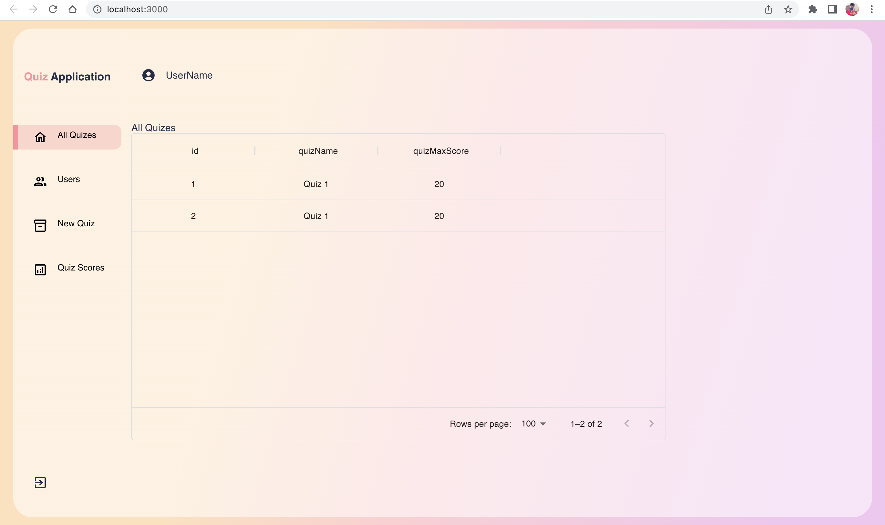
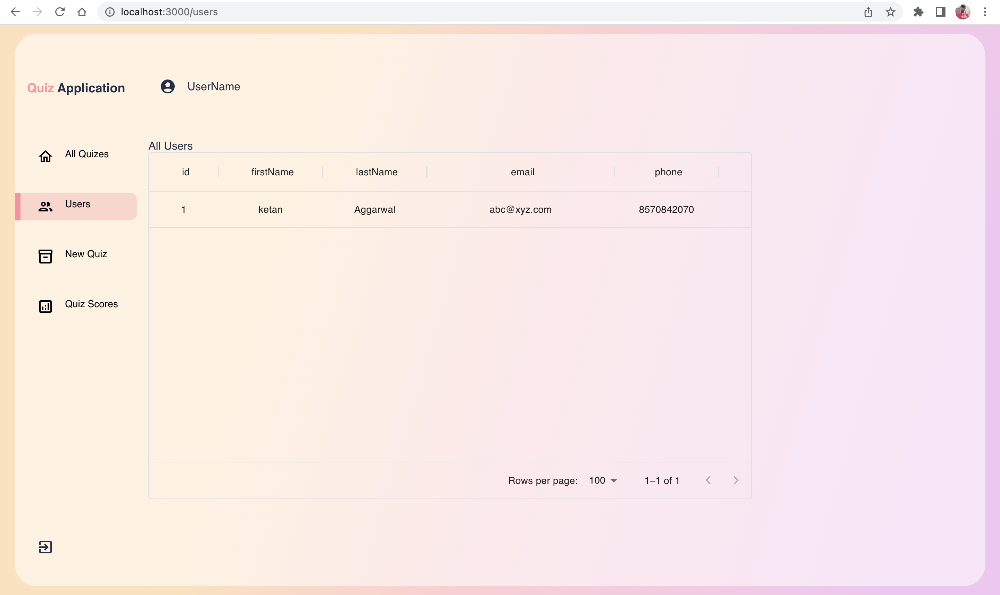
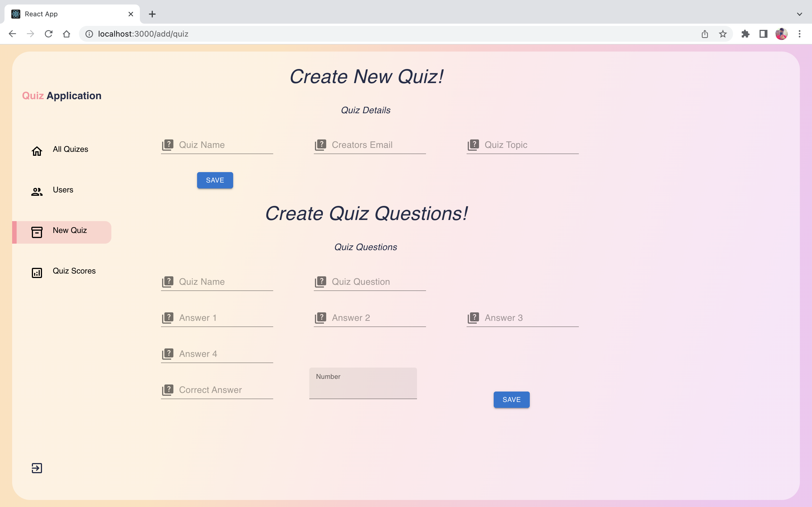

# Quiz Application

The Quiz Application it is an application in which any user according to their role they can generate the Quizes. 

The LMA folder holds two major folders and their details are listed down below:

1. Backend_django 
    The backend_django folder holds all the backend code.

As the project requirements were not present and i don't remember the actual project requriments you may find the project incomplete.

2. Quiz-Application
    This folder holds the react [TypeScript] code base in which you will find an simple dashboard which is created in the reactjs with the help of typescript. 


## Django Application
In Django application i have used the Django Rest Framework which helps us to cut the boiler plate code.

Note in the folder you may also find the docker file as my docker deamon causing some issue due to which i am not able to provide you an docker container.

### Packages Used in the Application Server

i have added an requirements.txt file which holds all the dependies with thier versions.

major dependies used are listed down below:

1. Django
2. django rest framework
3. django cors headers - for enabling the Cross origins Access for APIs;
4. PyJWT - python Json web Tokens for generating and decoding the JWT tokens.
5. and many more packages.

**Note** - SQL files holds some of the queries which are tested and used in the database. 

## React Application

Due to The shortage of time the Application is not completed and API integration is not done.

the react dependies which i have used are:
1. Matrial UI
2. Google Fonts


The Data in the table will be only visible when the backend sever will be running because in admin panel all the APIs are integrated.

to install the dependendies use the following command in your terminal/command prompt

```$ npm install```

some sample shots of the React Application.

HomePage


User Screen


New Quiz Screen
